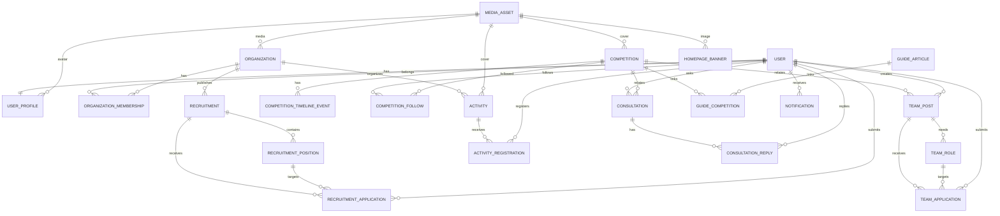

# database-design.md

> 产品：人工智能学院科创与就业服务平台  
> 仓库：`campus-innovation-hub`  
> 文档版本：0.1  
> 产品里程碑：V0.1  
> 数据库：PostgreSQL  
> ORM：Django ORM  
> 状态：Database Baseline（BE-000 已冻结）
> 文档职责：定义 V0.1 领域模型、数据库表、字段、约束、索引、状态机、隐私边界、删除策略和 Migration 规则  
> 上游事实来源：`docs/product/PRD.md`、`docs/product/PageMap.md`  
> 下游约束对象：Django Models、DRF Schema、Frontend Domain Types、APIContract、Migration、测试

---

# 0. 文档原则

本文件是 V0.1 数据层的事实来源。

它回答：

```text
系统需要保存哪些业务事实？
这些事实分别属于什么表？
字段是什么类型？
什么不能为空？
哪些数据不能重复？
状态怎样流转？
谁能够创建或修改？
删除后历史怎样保留？
哪些查询必须有索引？
```

它不负责：

```text
页面视觉
组件样式
前端动效
API URL 的最终命名
```

页面与交互以 `PageMap.md` 为准，视觉以 `FrontendDesign.md` 为准。

当 PRD、PageMap 与本文件发生字段层冲突时：

1. 产品行为先以 PRD / PageMap 为业务依据；
2. 数据表达以本文件为数据库依据；
3. 如果业务要求无法被当前表结构正确表达，不允许在代码里偷偷增加临时字段；
4. 应先更新本文件，再创建 Migration。

---

# 1. 总体数据库策略

## 1.1 数据库与 ORM

生产：

```text
PostgreSQL
Django ORM
```

不使用：

```text
MongoDB
Elasticsearch
Redis 作为主数据源
独立搜索数据库
微服务独立数据库
```

V0.1 的业务数据规模不需要复杂数据基础设施。

---

## 1.2 主键

所有项目业务模型统一使用：

```text
UUID v4
```

Django：

```python
UUIDField(primary_key=True, default=uuid.uuid4, editable=False)
```

原因：

- API 与前端路由可长期稳定使用；
- 不依赖全局连续整数；
- 数据导入、迁移和未来拆分冲突概率低；
- V0.1 数据量较小，UUID 索引成本可以接受；
- 不需要额外引入 ULID 库。

UUID 不作为权限保护手段。

---

## 1.3 时间

数据库保存：

```text
timestamp with time zone
```

Django：

```text
USE_TZ = True
TIME_ZONE = Asia/Shanghai
```

API 使用 ISO 8601。

前端负责按简体中文格式展示。

数据库不保存：

```text
"还有 3 天截止"
"明天下午"
"报名中"
```

这类可由时间和状态计算出的展示文本。

---

## 1.4 命名

数据库：

```text
snake_case
```

Django Model：

```text
PascalCase
```

外键物理列：

```text
user_id
competition_id
organization_id
```

布尔字段：

```text
is_active
is_featured
is_required
```

时间字段：

```text
created_at
updated_at
published_at
closed_at
processed_at
```

---

## 1.5 通用审计字段

普通可编辑业务实体默认：

```text
id
created_at
updated_at
```

由运营人员管理的正式内容增加：

```text
created_by_id
updated_by_id
```

不要求所有关联表都机械加入 `updated_by`。

---

## 1.6 不使用全局 `deleted_at`

V0.1 不给所有表统一增加：

```text
is_deleted
deleted_at
```

原因：

- 会污染所有查询；
- 会让唯一约束变复杂；
- 容易产生“已删除但仍被引用”的幽灵数据。

业务生命周期使用显式状态表达：

```text
DRAFT
PUBLISHED
CANCELLED
ARCHIVED
CLOSED
ENDED
WITHDRAWN
```

只有真正临时、可重建的数据可以物理删除。

---

# 2. 删除与外键策略

## 2.1 默认原则

用户看得见的历史业务记录：

```text
不级联物理删除
```

例如：

- 竞赛
- 活动
- 招新
- 申请
- 组队
- 咨询

使用：

```text
PROTECT
SET_NULL
状态关闭 / 归档
```

而不是 `CASCADE` 一路清空。

---

## 2.2 用户

正常产品流程不提供“删除用户”。

用户停用：

```text
accounts_user.is_active = false
```

业务记录继续保留。

---

## 2.3 媒体

业务表对图片 / 文件使用：

```text
SET_NULL
```

媒体本身通过 `media_asset.status` 管理生命周期。

对象存储文件不随普通业务对象删除立即物理清理。

---

# 3. 隐私分级

文档使用三个隐私等级描述字段，不额外建立数据库列。

## PUBLIC

可以出现在公开页面。

例如：

```text
昵称
专业
年级
组织名称
竞赛名称
公开简介
```

## INTERNAL

仅登录用户、业务参与方或管理人员可见。

例如：

```text
申请正文
活动报名记录
组织申请状态
```

## SENSITIVE

个人敏感业务数据，只向必要主体返回。

例如：

```text
学号
真实姓名
手机号
微信
QQ
私人联系方式
```

数据库备份同样包含这些数据，必须按敏感数据处理。

---

# 4. Markdown 与正文存储

V0.1 正文统一采用：

```text
Markdown source
```

字段命名使用：

```text
description_md
body_md
answer_md
```

禁止数据库保存未经审核的任意 HTML 作为正式正文来源。V0.1 Markdown renderer 必须默认禁用 raw HTML；Markdown 转换出的 HTML 在渲染边界必须 sanitize。API 只传输 Markdown source，不传输未经清洗的 HTML。

渲染：

```text
Markdown -> Sanitized HTML
```

前端编辑器可以变化，但数据库的 canonical source 是 Markdown。

---

# 5. 领域总览

```text
Accounts
├─ accounts_user
└─ accounts_user_profile

Media
└─ media_asset

Organizations
├─ organizations_organization
├─ organizations_membership
├─ organizations_recruitment
├─ organizations_recruitment_position
└─ organizations_recruitment_application

Competitions
├─ competitions_competition
├─ competitions_timeline_event
└─ competitions_follow

Teams
├─ teams_team_post
├─ teams_team_role
└─ teams_team_application

Activities
├─ activities_activity
└─ activities_registration

Content
├─ content_homepage_banner
├─ content_announcement
├─ content_guide_article
├─ content_guide_competition
└─ content_faq_item

Consultations
├─ consultations_consultation
└─ consultations_reply

Notifications
└─ notifications_notification

Audit
└─ audit_audit_log
```

V0.1 共 25 张业务表。

Django 自带的：

```text
django_migrations
django_session
django_content_type
auth_permission
django_admin_log
```

不计入业务表数量。

---

# 6. 明确不建的表

V0.1 不建立：

```text
achievement
achievement_review
patent
paper
software_copyright

job
company
employment_application

chat
conversation
private_message

social_follow
like
reaction
ranking
points

organization_department
organization_internal_role
organization_role_permission

team_membership

search_index

user_preference
```

说明：

- 科创成果属于 V0.2；
- 就业岗位系统未进入当前 PRD；
- 组队加入关系 V0.1 由 `TeamApplication.status = ACCEPTED` 推导；
- 主题偏好 V0.1 使用客户端 Color Mode / local storage，不要求数据库同步；
- 搜索直接查询业务表，数据量增长后再评估独立索引方案。

---

# 7. ER 关系



---

# 8. Accounts

## 8.1 `accounts_user`

Django：

```text
AUTH_USER_MODEL = accounts.User
```

建议继承：

```text
AbstractUser
```

但从项目第一条 Migration 就使用自定义 User，不要上线后再切换。

`identity_type` 与 `platform_role` 是两个不同维度：

```text
identity_type:
  STUDENT
  TEACHER

platform_role:
  USER
  OPERATOR

is_superuser:
  true -> SUPERADMIN
```

| 字段 | 类型 | Null | 约束 / 说明 | 隐私 |
|---|---|---:|---|---|
| `id` | uuid | 否 | PK | INTERNAL |
| `username` | varchar(150) | 否 | unique | INTERNAL |
| `identity_type` | varchar(20) | 否 | STUDENT / TEACHER | INTERNAL |
| `student_no` | varchar(32) | 是 | unique when not null；STUDENT 必填 | SENSITIVE |
| `employee_no` | varchar(32) | 是 | unique when not null；TEACHER 必填 | SENSITIVE |
| `real_name` | varchar(80) | 否 | | SENSITIVE |
| `email` | varchar(254) | 是 | 账号联系邮箱，可选 | SENSITIVE |
| `platform_role` | varchar(20) | 否 | USER / OPERATOR | INTERNAL |
| `is_active` | bool | 否 | Django 标准字段 | INTERNAL |
| `is_staff` | bool | 否 | Django Admin 访问，不等于 OPERATOR | INTERNAL |
| `is_superuser` | bool | 否 | SUPERADMIN 唯一事实来源 | INTERNAL |
| `password` | varchar | 否 | Django 密码哈希 | SENSITIVE |
| `last_login` | timestamptz | 是 | Django | INTERNAL |
| `date_joined` | timestamptz | 否 | Django | INTERNAL |

### Check Constraints

身份与机构编号必须一致：

```text
(identity_type = 'STUDENT'
 AND student_no IS NOT NULL
 AND employee_no IS NULL)

OR

(identity_type = 'TEACHER'
 AND employee_no IS NOT NULL
 AND student_no IS NULL)
```

禁止普通业务接口修改：

```text
identity_type
student_no
employee_no
platform_role
is_staff
is_superuser
```

这些字段由受控后台流程维护。

### 有效平台权限

API 层计算：

```text
identity = identity_type

if is_superuser:
    effective_platform_permission = SUPERADMIN
else:
    effective_platform_permission = platform_role  # USER / OPERATOR
```

不要再使用：

```text
platform_role = STUDENT
```

因为 STUDENT / TEACHER 是身份，而 USER / OPERATOR 是平台权限。

### 索引

```text
unique(username)
unique(student_no) WHERE student_no IS NOT NULL
unique(employee_no) WHERE employee_no IS NOT NULL
index(identity_type, is_active)
index(platform_role, is_active)
```

### 账号创建规则

学生：

```text
学生注册流程
-> identity_type = STUDENT
-> student_no required
```

教师：

```text
V0.1 不允许在学生注册页自选 TEACHER
SUPERADMIN 通过 Django Admin / 受控导入创建
-> identity_type = TEACHER
-> employee_no required
```

教师身份本身不自动获得：

```text
OPERATOR
ADVISOR
SUPERADMIN
```

OPERATOR 不自动拥有 Django Admin 权限。

### 规则

- 学生注册必须提供 `student_no` 和 `real_name`；自助注册时 `username = student_no`，创建 `identity_type = STUDENT`、`platform_role = USER` 的 User，并在同一事务创建 UserProfile；新账号的 `is_active` 由服务端 `STUDENT_REGISTRATION_AUTO_ACTIVATE` 决定，招新期 production 显式设为 `true` 时立即启用，关闭时仍进入人工审核；
- 教师账号不得使用学生自助注册页创建；仅 SUPERADMIN 通过 Django Admin / 受控导入创建 `identity_type = TEACHER` 账号；
- `is_active = false` 表示账号不可登录，可能是待审核或被停用；公开认证错误不得区分两种内部原因；
- 自动启用关闭时，仅 Django Admin 中的 SUPERADMIN 启用待审核账号；V0.1 不建立注册审核表、学生名单校验、学校统一认证或自助密码重置；
- 系统维护账号可以 `student_no = null`、`employee_no = null`；
- 禁用账号不删除历史业务数据。
- 账号注销采用“用户申请 → SUPERADMIN 确认 → `is_active=false` → 最小匿名化”流程，不做 `DELETE CASCADE`：保留 User UUID 与关联业务历史，移除学号、真实姓名、账号名、密码、邮箱及 Profile 的直接身份字段；超级管理员不适用该批量流程。

---

## 8.1.1 `accounts_auth_throttle`

认证端点只保存短期、不可逆的节流状态；它不记录密码、明文 IP、学号、真实姓名、请求 body 或失败原因。

| 字段 | 类型 | Null | 约束 / 说明 | 隐私 |
|---|---|---:|---|---|
| `id` | bigint | 否 | Django 自增 PK | INTERNAL |
| `scope` | varchar(32) | 否 | `LOGIN_IP` / `LOGIN_USERNAME` / `REGISTER_IP` | INTERNAL |
| `subject_digest` | char(64) | 否 | `HMAC-SHA256(AUTH_THROTTLE_HMAC_KEY, normalized_subject)` | SENSITIVE |
| `failure_count` | smallint | 否 | 非负；仅用于短时退避 | INTERNAL |
| `window_started_at` | timestamptz | 否 | 当前计数窗口开始时间 | INTERNAL |
| `blocked_until` | timestamptz | 是 | 未阻断时为 null | INTERNAL |
| `created_at` | timestamptz | 否 | | INTERNAL |
| `updated_at` | timestamptz | 否 | | INTERNAL |

### 约束、生命周期与使用边界

```text
unique(scope, subject_digest)
index(blocked_until)
```

- `normalized_subject` 对用户名使用 `strip().casefold()`，对 IP 使用标准化地址文本；摘要 key 与 Django `SECRET_KEY` 在生产环境中独立配置；
- 登录在 IP 与用户名两个 scope 上检查；注册只在 IP scope 上检查；不使用 Redis、Cookie 或前端计数作为授权依据；
- 第五次连续凭据失败后，下一次登录在 30 秒内返回 `429 RATE_LIMITED`；之后的连续失败指数退避，上限 15 分钟；成功登录只清除该用户名维度，避免一个账号解锁整个 NAT；
- 仅保留仍处于窗口或阻断期内的记录。`purge_auth_throttles` 管理命令清理超过 30 天的记录，运维按日运行；
- 该表是安全运行数据，不加入公开 Serializer、AuditLog、搜索索引或备份以外的业务导出。

---

## 8.2 `accounts_user_profile`

一张 Profile 表同时承载学生与教师的公开 / 辅助资料。

身份专属字段允许为空，但 Serializer 必须按 `identity_type` 输出和校验。

| 字段 | 类型 | Null | 约束 / 说明 | 隐私 |
|---|---|---:|---|---|
| `id` | uuid | 否 | PK | INTERNAL |
| `user_id` | uuid | 否 | FK User, unique, PROTECT | INTERNAL |
| `nickname` | varchar(40) | 是 | 学生常用公开显示名 | PUBLIC |
| `public_name` | varchar(80) | 是 | TEACHER 正式公开姓名；成为 ADVISOR 前必填 | PUBLIC |
| `avatar_asset_id` | uuid | 是 | FK MediaAsset, SET_NULL | PUBLIC |
| `major` | varchar(80) | 是 | STUDENT 常用 | PUBLIC |
| `grade` | smallint | 是 | STUDENT；1–4 | PUBLIC |
| `class_name` | varchar(80) | 是 | STUDENT；默认不公开 | SENSITIVE |
| `department` | varchar(120) | 是 | TEACHER；学院 / 部门 | PUBLIC |
| `academic_title` | varchar(80) | 是 | TEACHER；如教授 / 副教授 / 讲师 | PUBLIC |
| `public_email` | varchar(254) | 是 | TEACHER 主动公开的邮箱 | PUBLIC |
| `office_location` | varchar(160) | 是 | TEACHER 可选 | PUBLIC |
| `bio` | varchar(500) | 是 | | PUBLIC |
| `skills_json` | jsonb | 否 | STUDENT string[]，默认 `[]` | PUBLIC |
| `research_interests_json` | jsonb | 否 | TEACHER string[]，默认 `[]` | PUBLIC |
| `created_at` | timestamptz | 否 | | INTERNAL |
| `updated_at` | timestamptz | 否 | | INTERNAL |

### Check

```text
grade IS NULL OR grade BETWEEN 1 AND 4
```

### JSON Schema

`skills_json`：

```json
["Python", "Vue", "数据分析"]
```

`research_interests_json`：

```json
["机器学习", "自然语言处理"]
```

V0.1 不建立 SkillTag / ResearchInterestTag 表。

Serializer 必须校验两个数组：

- 必须是数组；
- 每项是字符串；
- 单项 <= 40 字符；
- 最多 20 项；
- 去重后保存。

### 身份字段输出

STUDENT 优先使用：

```text
nickname
major
grade
class_name
skills_json
```

TEACHER 优先使用：

```text
public_name
department
academic_title
public_email
office_location
research_interests_json
```

---

# 9. Media

## 9.1 `media_asset`

PostgreSQL 不保存二进制文件。

真实文件使用如下已冻结的对象存储接口：

```text
ObjectStorage
├─ LocalStorageBackend（仅 development）
└─ S3CompatibleStorageBackend（production）
```

数据库只保存元数据与 object key。生产使用托管 S3-compatible 服务，按部署环境选择 OSS、COS、R2、S3 或其他兼容服务；不得在 2C2G 应用服务器自建 MinIO。

| 字段 | 类型 | Null | 约束 |
|---|---|---:|---|
| `id` | uuid | 否 | PK |
| `created_by_id` | uuid | 是 | FK User, SET_NULL |
| `kind` | varchar(20) | 否 | IMAGE / DOCUMENT |
| `object_key` | varchar(500) | 否 | unique |
| `original_name` | varchar(255) | 否 | |
| `mime_type` | varchar(100) | 否 | |
| `size_bytes` | bigint | 否 | > 0 |
| `sha256` | char(64) | 否 | |
| `width` | int | 是 | image only |
| `height` | int | 是 | image only |
| `status` | varchar(20) | 否 | ACTIVE / PENDING_DELETE / DELETED |
| `created_at` | timestamptz | 否 | |
| `deleted_at` | timestamptz | 是 | media lifecycle only |

### 索引

```text
unique(object_key)
index(sha256)
index(status, created_at)
```

### 上传约束

V0.1 图片：

```text
jpg
jpeg
png
webp
avif（浏览器 / 处理链支持时）
```

默认单张最大：

```text
5 MB
```

服务端还必须在完整解码前后同时限制：请求 JSON 不超过 1 MB、媒体上传请求不超过 6 MB、图片解码像素不超过 `16_777_216`。允许格式须由 Pillow 完整解码后重新编码为同一受信任格式；数据库的 `mime_type`、`size_bytes`、`sha256`、尺寸与 object key 均以重新编码结果为准。SVG、路径穿越、声明 MIME 与实际格式不一致、损坏数据、超尺寸或超像素图片一律拒绝。

文档附件如果后续启用：

```text
20 MB
```

前后端限制必须一致，服务端是最终权威。

### 存储与公开 DTO 边界

业务代码通过 ObjectStorage 的保存、公开 URL 获取与删除语义操作对象，不得在 Competition、Activity、Organization 或 Serializer 中直接调用云厂商 SDK。`object_key`、`sha256`、创建者、状态和供应商信息是内部元数据；公开 API 中的 MediaRef 只返回：

```json
{
  "id": "uuid",
  "url": "https://media.example.edu/path/image.webp"
}
```

---

# 10. Organizations

## 10.1 `organizations_organization`

| 字段 | 类型 | Null | 约束 |
|---|---|---:|---|
| `id` | uuid | 否 | PK |
| `name` | varchar(100) | 否 | unique |
| `organization_type` | varchar(30) | 否 | enum |
| `short_intro` | varchar(200) | 是 | |
| `description_md` | text | 是 | <= 10000 chars |
| `logo_asset_id` | uuid | 是 | SET_NULL |
| `banner_asset_id` | uuid | 是 | SET_NULL |
| `public_contact` | varchar(200) | 是 | 仅正式公开联系方式 |
| `qq_group_number` | varchar(30) | 是 | 招新 QQ 群号（公开，5–15 位数字，可含横杠） |
| `qq_group_qr_asset_id` | uuid | 是 | FK media_asset SET_NULL，招新 QQ 群二维码图片 |
| `qq_group_join_url` | varchar(500) | 是 | QQ 群入群链接 / 跳转 URL（可选，与二维码二选一或并存） |
| `allow_online_application` | bool | 否 | 是否启用平台在线申请（双轨并行开关），default true；组织负责人可自由关闭，仅保留引流 |
| `related_links_json` | jsonb | 否 | 友情链接：与本组织相关的竞赛/活动外链，默认 `[]`，用于“相关竞赛”展示 |
| `is_active` | bool | 否 | default true |
| `created_by_id` | uuid | 是 | SET_NULL |
| `updated_by_id` | uuid | 是 | SET_NULL |
| `created_at` | timestamptz | 否 | |
| `updated_at` | timestamptz | 否 | |

指导老师不再存：

```text
advisor_name
```

指导老师必须从：

```text
OrganizationMembership.role = ADVISOR
```

查询得到，避免“账号关系”和“文本姓名”形成双重事实来源。

### organization_type

```text
COLLEGE_DEPARTMENT
STUDENT_CLUB
LABORATORY
INNOVATION_TEAM
OTHER
```

### 索引

```text
unique(name)
index(organization_type, is_active)
```

### 删除

不允许组织负责人 / 指导老师删除组织。

停用：

```text
is_active = false
```

只有 SUPERADMIN 可执行。

### 新增字段说明（双轨并行 · 引流为主）

* `qq_group_*` 三字段为**公开引流**事实：群号为文本、二维码为 `media_asset`、入群链接为 URL；三者可独立存在，页面优先展示二维码，其次群号/链接，且支持一键复制群号。
* `allow_online_application` 为组织级开关：`true` 时组织主页与招新详情同时展示“查看入群方式（主）+ 在线申请（辅）”；`false` 时仅展示入群方式，在线申请入口自动隐藏，但后端 `RecruitmentApplication` 能力保留，科创部等自用组织可保持 `true`。
* `related_links_json` 结构：
  ```json
  [{ "label": "全国大学生数学建模竞赛", "url": "/competitions/xxx", "type": "competition" }]
  ```
  校验：数组 0–10 项，单项 `label <= 40`、`url <= 500`、`type in (competition, activity, external)`；不替代 `content_announcement` 的正式关联，仅为友情链接展示。

---

## 10.2 `organizations_membership`

这是：

> 用户与组织之间的权限作用域关系。

`title` 只用于展示，不参与权限判断。

| 字段 | 类型 | Null | 约束 |
|---|---|---:|---|
| `id` | uuid | 否 | PK |
| `organization_id` | uuid | 否 | FK Organization, PROTECT |
| `user_id` | uuid | 否 | FK User, PROTECT |
| `role` | varchar(20) | 否 | MEMBER / LEADER / ADVISOR |
| `title` | varchar(80) | 是 | 如“部长”“会长”“技术部干事”“指导老师” |
| `is_active` | bool | 否 | |
| `joined_at` | timestamptz | 否 | |
| `left_at` | timestamptz | 是 | |
| `created_at` | timestamptz | 否 | |
| `updated_at` | timestamptz | 否 | |

### Unique

```text
unique(organization_id, user_id)
```

同一人同一组织只有一行 membership。

退出后：

```text
is_active = false
left_at = now()
```

重新加入：

```text
重新激活同一行
```

### 索引

```text
index(user_id, is_active)
index(organization_id, role, is_active)
```

### 角色

```text
MEMBER
普通组织成员

LEADER
组织学生负责人 / 日常负责人

ADVISOR
组织指导老师
```

### ADVISOR 身份约束

数据库普通 CheckConstraint 无法直接跨表检查 User.identity_type。

因此必须由：

```text
Service
Django Admin validation
Serializer validation
Test
```

共同保证：

```text
role = ADVISOR
=> user.identity_type = TEACHER
=> user.profile.public_name IS NOT NULL
```

### 组织管理权限

V0.1 定义：

```text
ORG_MANAGER(org)
=
active Membership
AND role IN (LEADER, ADVISOR)
AND membership.organization_id = current organization_id
```

`LEADER` 与 `ADVISOR` 对当前组织拥有相同的基础管理能力：

- 编辑组织资料
- 管理招新
- 查看申请
- 接受 / 拒绝申请

不做 LEADER -> ADVISOR 二级审批链。

### 授权

只有 SUPERADMIN 可以直接授予 / 撤销：

```text
LEADER
ADVISOR
```

招新申请通过只产生：

```text
MEMBER
```

不会产生 `LEADER` 或 `ADVISOR`。

OPERATOR 不自动拥有任何组织管理身份。

---

# 11. Recruitment

## 11.1 `organizations_recruitment`

| 字段 | 类型 | Null | 说明 |
|---|---|---:|---|
| `id` | uuid | 否 | PK |
| `organization_id` | uuid | 否 | PROTECT |
| `title` | varchar(120) | 否 | |
| `intro_md` | text | 否 | <= 10000 |
| `apply_start_at` | timestamptz | 是 | |
| `apply_end_at` | timestamptz | 否 | |
| `target_grade_min` | smallint | 是 | 1–4 |
| `target_grade_max` | smallint | 是 | 1–4 |
| `notes_md` | text | 是 | <= 5000 |
| `publication_state` | varchar(20) | 否 | DRAFT/PUBLISHED/CANCELLED/ARCHIVED |
| `completed_at` | timestamptz | 是 | 申请处理完成 |
| `qq_group_number` | varchar(30) | 是 | 本轮招新独立 QQ 群号（为空则回退到组织级群号） |
| `qq_group_qr_asset_id` | uuid | 是 | FK media_asset SET_NULL，本轮招新独立二维码 |
| `qq_group_join_url` | varchar(500) | 是 | 本轮招新独立入群链接 |
| `enable_online_application` | bool | 否 | 本轮是否启用在线申请，default true；受组织级 allow_online_application 约束 |
| `created_by_id` | uuid | 否 | leader / admin |
| `updated_by_id` | uuid | 否 | |
| `created_at` | timestamptz | 否 | |
| `updated_at` | timestamptz | 否 | |

### Check

```text
apply_start_at IS NULL OR apply_start_at <= apply_end_at
target_grade_min IS NULL OR 1 <= target_grade_min <= 4
target_grade_max IS NULL OR 1 <= target_grade_max <= 4
target_grade_min/max 同时存在时 min <= max
```

### 派生 application_state

数据库不重复保存 `报名中`：

```text
publication_state = DRAFT      -> DRAFT
publication_state = CANCELLED  -> CANCELLED
publication_state = ARCHIVED   -> ARCHIVED
completed_at != null           -> COMPLETED
now < apply_start_at           -> UPCOMING
now <= apply_end_at            -> OPEN
else                            -> CLOSED
```

### 索引

```text
index(organization_id, publication_state)
index(publication_state, apply_end_at)
```

### 双轨并行规则

* 组织级 `allow_online_application = false` 时，该组织所有招新即使 `enable_online_application = true`，前端也不展示在线申请入口（后端仍保留接口供科创部自用组织直接调用）。
* 招新级 `enable_online_application = false` 时，单轮招新仅展示入群方式。
* 前端主操作永远是“查看入群方式（QQ 群二维码/群号/链接）”，次操作为“在线申请（试点）”；未提供任何 QQ 信息时，回退展示 `public_contact`。
* `qq_group_*` 招新级为空时回退到组织级；组织级也为空则该招新不展示二维码，仅展示文字联系方式。

---

## 11.2 `organizations_recruitment_position`

| 字段 | 类型 | Null | 说明 |
|---|---|---:|---|
| `id` | uuid | 否 | PK |
| `recruitment_id` | uuid | 否 | PROTECT |
| `name` | varchar(60) | 否 | |
| `headcount` | smallint | 否 | > 0 |
| `description_md` | text | 是 | <= 3000 |
| `requirements_md` | text | 是 | <= 3000 |
| `sort_order` | int | 否 | >= 0 |
| `created_at` | timestamptz | 否 | |
| `updated_at` | timestamptz | 否 | |

### Unique

```text
unique(recruitment_id, name)
```

---

## 11.3 `organizations_recruitment_application`

| 字段 | 类型 | Null | 隐私 |
|---|---|---:|---|
| `id` | uuid | 否 | INTERNAL |
| `recruitment_id` | uuid | 否 | INTERNAL |
| `position_id` | uuid | 否 | INTERNAL |
| `applicant_id` | uuid | 否 | INTERNAL |
| `self_intro` | text | 否 | INTERNAL |
| `skills` | varchar(1000) | 是 | INTERNAL |
| `experience` | text | 是 | INTERNAL |
| `motivation` | text | 否 | INTERNAL |
| `status` | varchar(20) | 否 | INTERNAL |
| `processed_by_id` | uuid | 是 | INTERNAL |
| `processed_at` | timestamptz | 是 | INTERNAL |
| `created_at` | timestamptz | 否 | INTERNAL |
| `updated_at` | timestamptz | 否 | INTERNAL |

### status

```text
PENDING
ACCEPTED
REJECTED
WITHDRAWN
```

### 部分唯一约束

同一用户同一轮招新不能同时有多个有效申请：

```text
UNIQUE (recruitment_id, applicant_id)
WHERE status IN ('PENDING', 'ACCEPTED')
```

被拒绝或撤回后，若招新仍开放，可以重新提交。

### 索引

```text
index(recruitment_id, status, created_at)
index(position_id, status)
index(applicant_id, created_at desc)
```

### 通过申请的事务

`ACCEPTED` 必须在同一个数据库事务内完成：

```text
锁定申请
确认仍为 PENDING
确认 Recruitment 可处理
确认 Position 未超计划人数
申请 -> ACCEPTED
创建 / 激活 OrganizationMembership
membership.role = MEMBER
membership.title 默认使用 position.name
创建 Notification
commit
```

`LEADER` 不通过招新自动授予。

---

# 12. Competitions

## 12.1 `competitions_competition`

一场竞赛按“届次”保存一条记录。

例如：

```text
name = 全国大学生数学建模竞赛
edition = 2026
```

| 字段 | 类型 | Null | 说明 |
|---|---|---:|---|
| `id` | uuid | 否 | PK |
| `name` | varchar(120) | 否 | |
| `edition` | varchar(40) | 否 | 如 2026 / 第十七届 |
| `category` | varchar(30) | 否 | enum |
| `level` | varchar(30) | 否 | enum |
| `participation_mode` | varchar(20) | 否 | INDIVIDUAL / TEAM |
| `suitable_grade_min` | smallint | 是 | |
| `suitable_grade_max` | smallint | 是 | |
| `direction` | varchar(300) | 是 | 多标签分类（原“面向方向”改“分类”），多个标签以“、”分隔，单个标签 1–20 字符，最多 10 个，预制标签见下 |
| `summary` | varchar(300) | 是 | |
| `description_md` | text | 否 | <= 20000 |
| `suitable_for_md` | text | 是 | <= 10000 |
| `preparation_advice_md` | text | 是 | <= 10000 |
| `registration_start_at` | timestamptz | 是 | |
| `registration_end_at` | timestamptz | 是 | |
| `event_start_at` | timestamptz | 是 | |
| `event_end_at` | timestamptz | 是 | |
| `college_organized` | bool | 否 | |
| `college_contact_name` | varchar(100) | 是 | |
| `college_contact_text` | varchar(200) | 是 | |
| `official_url` | varchar(500) | 是 | URL |
| `registration_url` | varchar(500) | 是 | URL |
| `official_notice_url` | varchar(500) | 是 | URL |
| `cover_asset_id` | uuid | 是 | SET_NULL |
| `publication_state` | varchar(20) | 否 | |
| `is_featured` | bool | 否 | |
| `featured_order` | int | 否 | default 0 |
| `created_by_id` | uuid | 否 | |
| `updated_by_id` | uuid | 否 | |
| `created_at` | timestamptz | 否 | |
| `updated_at` | timestamptz | 否 | |

### category

```text
AI                  人工智能
PROGRAMMING         程序设计
INNOVATION          创新创业
MATHEMATICAL_MODELING 数学建模
ELECTRONICS         电子
ROBOTICS            机器人
CYBERSECURITY       网络安全
ELECTRONIC_DESIGN   电子设计
MECHANICAL_DESIGN   机械设计
OTHER               其他
```

> `direction` 为多标签扩展：预制标签与 `category` 中文标签对齐，前端以多选芯片输入，最多 10 个，存储为“、”分隔；筛选时 `category` 与 `direction` 均按标签包含匹配，兼容历史单标签数据。

### level

```text
SCHOOL
PROVINCIAL
NATIONAL
INTERNATIONAL
OTHER
```

### publication_state

```text
DRAFT
PUBLISHED
CANCELLED
ARCHIVED
```

### Unique

```text
unique(name, edition)
```

### Check

```text
registration_start_at <= registration_end_at
event_start_at <= event_end_at
grade 1–4
grade_min <= grade_max
featured_order >= 0
```

只在对应字段同时存在时检查。

### 派生状态

将“发布生命周期”和“时间阶段”分开，避免状态过期。

`registration_state`：

```text
NOT_AVAILABLE
UPCOMING
OPEN
CLOSED
```

`event_phase`：

```text
UPCOMING
IN_PROGRESS
ENDED
```

UI 显示状态由：

```text
publication_state
+
registration_state
+
event_phase
```

计算。

数据库不存：

```text
display_status = 报名中
```

### 索引

```text
index(publication_state, registration_end_at)
index(category, publication_state)
index(level, publication_state)
index(participation_mode, publication_state)
index(is_featured, featured_order)
index(event_start_at)
```

---

## 12.2 `competitions_timeline_event`

| 字段 | 类型 | Null |
|---|---|---:|
| `id` | uuid | 否 |
| `competition_id` | uuid | 否 |
| `title` | varchar(100) | 否 |
| `event_at` | timestamptz | 否 |
| `end_at` | timestamptz | 是 |
| `description` | varchar(500) | 是 |
| `sort_order` | int | 否 |
| `created_at` | timestamptz | 否 |
| `updated_at` | timestamptz | 否 |

索引：

```text
index(competition_id, event_at)
```

Check：

```text
end_at IS NULL OR event_at <= end_at
sort_order >= 0
```

---

## 12.3 `competitions_follow`

| 字段 | 类型 | Null |
|---|---|---:|
| `id` | uuid | 否 |
| `competition_id` | uuid | 否 |
| `user_id` | uuid | 否 |
| `created_at` | timestamptz | 否 |

Unique：

```text
unique(user_id, competition_id)
```

取消关注允许物理删除该关联行。

它不是业务历史记录。

---

# 13. Teams

## 13.1 `teams_team_post`

支持：

```text
TEAM_RECRUITING
PERSON_LOOKING
```

| 字段 | 类型 | Null | 说明 |
|---|---|---:|---|
| `id` | uuid | 否 | |
| `competition_id` | uuid | 否 | PROTECT |
| `author_id` | uuid | 否 | PROTECT |
| `post_type` | varchar(30) | 否 | |
| `title` | varchar(120) | 否 | |
| `team_name` | varchar(100) | 是 | |
| `direction` | varchar(500) | 否 | |
| `members_summary` | text | 是 | <= 3000 |
| `base_member_count` | smallint | 否 | >= 1 |
| `target_member_count` | smallint | 否 | >= base |
| `goal` | text | 是 | <= 3000 |
| `weekly_commitment` | varchar(200) | 是 | |
| `contact_method` | varchar(20) | 否 | private |
| `contact_value` | varchar(200) | 否 | SENSITIVE |
| `notes_md` | text | 是 | <= 5000 |
| `status` | varchar(20) | 否 | |
| `closed_at` | timestamptz | 是 | |
| `created_at` | timestamptz | 否 | |
| `updated_at` | timestamptz | 否 | |

### status

```text
RECRUITING
FULL
CLOSED
```

### contact_method

```text
WECHAT
QQ
PHONE
EMAIL
OTHER
```

### Check

```text
base_member_count >= 1
target_member_count >= base_member_count
```

### 实际人数

不把 accepted applicant 数重复写入 `current_count`。

计算：

```text
current_member_count
=
base_member_count
+
count(TeamApplication WHERE status = ACCEPTED)
```

防止字段漂移。

### 索引

```text
index(competition_id, status, created_at desc)
index(author_id, created_at desc)
index(post_type, status, created_at desc)
```

---

## 13.2 `teams_team_role`

一个 TeamPost 可以定义多个招募岗位。

| 字段 | 类型 | Null |
|---|---|---:|
| `id` | uuid | 否 |
| `team_post_id` | uuid | 否 |
| `name` | varchar(60) | 否 |
| `headcount` | smallint | 否 |
| `requirements` | varchar(1000) | 是 |
| `skills` | varchar(500) | 是 |
| `sort_order` | int | 否 |
| `created_at` | timestamptz | 否 |
| `updated_at` | timestamptz | 否 |

Unique：

```text
unique(team_post_id, name)
```

Check：

```text
headcount > 0
sort_order >= 0
```

---

## 13.3 `teams_team_application`

| 字段 | 类型 | Null | 隐私 |
|---|---|---:|---|
| `id` | uuid | 否 | INTERNAL |
| `team_post_id` | uuid | 否 | INTERNAL |
| `desired_role_id` | uuid | 是 | INTERNAL |
| `applicant_id` | uuid | 否 | INTERNAL |
| `self_intro` | text | 否 | INTERNAL |
| `skills` | varchar(1000) | 是 | INTERNAL |
| `experience` | text | 是 | INTERNAL |
| `motivation` | text | 否 | INTERNAL |
| `weekly_commitment` | varchar(200) | 是 | INTERNAL |
| `contact_method` | varchar(20) | 否 | SENSITIVE |
| `contact_value` | varchar(200) | 否 | SENSITIVE |
| `status` | varchar(20) | 否 | INTERNAL |
| `processed_at` | timestamptz | 是 | INTERNAL |
| `created_at` | timestamptz | 否 | INTERNAL |
| `updated_at` | timestamptz | 否 | INTERNAL |

status：

```text
PENDING
ACCEPTED
REJECTED
WITHDRAWN
```

### 部分唯一约束

```text
UNIQUE(team_post_id, applicant_id)
WHERE status IN ('PENDING', 'ACCEPTED')
```

### Check

```text
applicant_id != TeamPost.author_id
```

这条跨表不能用普通 DB CheckConstraint 完整表达，必须由 Service + Test 强制。

### 申请通过事务

必须：

```text
select_for_update(TeamPost)
select_for_update(TeamApplication)

确认 status = PENDING
确认 post.status = RECRUITING
计算当前 accepted 数
确认未超 target_member_count
如选择岗位，确认岗位名额未满

application -> ACCEPTED

如果达到目标人数：
    post.status -> FULL

创建 Notification
commit
```

---

# 14. Activities

## 14.1 `activities_activity`

| 字段 | 类型 | Null |
|---|---|---:|
| `id` | uuid | 否 |
| `title` | varchar(120) | 否 |
| `activity_type` | varchar(30) | 否 |
| `summary` | varchar(300) | 是 |
| `description_md` | text | 否 |
| `organizer_organization_id` | uuid | 是 |
| `organizer_name` | varchar(120) | 是 |
| `speaker` | varchar(200) | 是 |
| `location` | varchar(200) | 否 |
| `start_at` | timestamptz | 否 |
| `end_at` | timestamptz | 是 |
| `registration_required` | bool | 否 |
| `registration_start_at` | timestamptz | 是 |
| `registration_end_at` | timestamptz | 是 |
| `capacity` | int | 是 |
| `notes_md` | text | 是 |
| `cover_asset_id` | uuid | 是 |
| `publication_state` | varchar(20) | 否 |
| `is_featured` | bool | 否 |
| `featured_order` | int | 否 |
| `created_by_id` | uuid | 否 |
| `updated_by_id` | uuid | 否 |
| `created_at` | timestamptz | 否 |
| `updated_at` | timestamptz | 否 |

### activity_type

```text
COMPETITION_BRIEFING
TECH_SHARING
RESEARCH_LECTURE
FURTHER_STUDY
ENTERPRISE
TRAINING
OTHER
```

### publication_state

```text
DRAFT
PUBLISHED
CANCELLED
ARCHIVED
```

### Check

```text
end_at IS NULL OR start_at <= end_at
registration_start_at/end_at 同时存在时 start <= end
capacity IS NULL OR capacity > 0
featured_order >= 0
```

若：

```text
registration_required = false
```

则 Registration API 不接受报名。

### 派生状态

`registration_state`：

```text
NOT_REQUIRED
UPCOMING
OPEN
CLOSED
FULL
```

`event_phase`：

```text
UPCOMING
IN_PROGRESS
ENDED
```

若 `publication_state = CANCELLED`，任何报名操作拒绝。

### 索引

```text
index(publication_state, start_at)
index(activity_type, publication_state)
index(registration_end_at)
index(is_featured, featured_order)
```

---

## 14.2 `activities_registration`

一名学生对一场活动只有一行报名记录。

| 字段 | 类型 | Null | 隐私 |
|---|---|---:|---|
| `id` | uuid | 否 | INTERNAL |
| `activity_id` | uuid | 否 | INTERNAL |
| `user_id` | uuid | 否 | INTERNAL |
| `status` | varchar(20) | 否 | INTERNAL |
| `name_snapshot` | varchar(80) | 否 | SENSITIVE |
| `student_no_snapshot` | varchar(32) | 否 | SENSITIVE |
| `class_name_snapshot` | varchar(80) | 是 | SENSITIVE |
| `major_snapshot` | varchar(80) | 是 | INTERNAL |
| `grade_snapshot` | smallint | 是 | INTERNAL |
| `registered_at` | timestamptz | 否 | INTERNAL |
| `cancelled_at` | timestamptz | 是 | INTERNAL |
| `updated_at` | timestamptz | 否 | INTERNAL |

status：

```text
REGISTERED
CANCELLED
```

Unique：

```text
unique(activity_id, user_id)
```

取消后重新报名：

```text
复用同一行
status = REGISTERED
registered_at = now
cancelled_at = null
```

AuditLog 保留行为历史。

### 防重复与容量事务

报名必须：

```text
atomic transaction
select_for_update(Activity)
读取 / 创建 Registration
检查 registration_state
统计 status=REGISTERED
检查 capacity
写入报名
commit
```

这避免并发请求超售。

---

# 15. Content

## 15.1 `content_homepage_banner`

| 字段 | 类型 | Null |
|---|---|---:|
| `id` | uuid | 否 |
| `title` | varchar(80) | 否 |
| `subtitle` | varchar(160) | 是 |
| `category_label` | varchar(30) | 是 |
| `image_asset_id` | uuid | 否 |
| `alt_text` | varchar(160) | 是 |
| `link_type` | varchar(20) | 否 |
| `internal_path` | varchar(500) | 是 |
| `external_url` | varchar(500) | 是 |
| `start_at` | timestamptz | 是 |
| `end_at` | timestamptz | 是 |
| `is_active` | bool | 否 |
| `sort_order` | int | 否 |
| `created_by_id` | uuid | 否 |
| `updated_by_id` | uuid | 否 |
| `created_at` | timestamptz | 否 |
| `updated_at` | timestamptz | 否 |

link_type：

```text
NONE
INTERNAL
EXTERNAL
```

Check：

```text
start_at IS NULL OR end_at IS NULL OR start_at <= end_at
sort_order >= 0
```

Service 校验 link_type 与 URL 字段匹配。

首页最多读取：

```text
4 个有效 Banner
```

---

## 15.2 `content_announcement`

| 字段 | 类型 | Null |
|---|---|---:|
| `id` | uuid | 否 |
| `title` | varchar(160) | 否 |
| `summary` | varchar(300) | 是 |
| `body_md` | text | 否 |
| `publication_state` | varchar(20) | 否 |
| `published_at` | timestamptz | 是 |
| `is_pinned` | bool | 否 |
| `is_home_featured` | bool | 否 | default false，首页精选开关，与 `is_pinned` 解耦 |
| `home_featured_order` | int | 否 | default 0，`is_home_featured=true` 时首页排序，`>=0` |
| `publisher_scope` | varchar(20) | 否 | 公告正式发布主体：ACADEMY / UNIVERSITY / PLATFORM，与公开筛选一致，见下 |
| `source_name` | varchar(160) | 是 | 信息来源展示文本，与 `publisher_scope` 正交；如“大赛官网 / 教务处”，可空，`<=160` |
| `competition_id` | uuid | 是 |
| `activity_id` | uuid | 是 |
| `organization_id` | uuid | 是 |
| `recruitment_id` | uuid | 是 |
| `external_url` | varchar(500) | 是 |
| `created_by_id` | uuid | 否 |
| `updated_by_id` | uuid | 否 |
| `created_at` | timestamptz | 否 |
| `updated_at` | timestamptz | 否 |

publication_state：

```text
DRAFT
PUBLISHED
ARCHIVED
```

### publisher_scope

```text
ACADEMY      学院公告
UNIVERSITY   学校公告
PLATFORM     平台公告
```

`publisher_scope` 表示公告的正式发布来源，不从是否存在关联对象或外链推断。它用于公开列表的来源标识与筛选；发布者用户仍由 `created_by_id` / `updated_by_id` 记录。

### 信息来源 `source_name`

```text
source_name 为空：不展示来源
source_name 非空：公开详情与预览页底部“信息来源”区展示；与 publisher_scope 正交
  - publisher_scope = PLATFORM + source_name = 大赛官网  → 平台转载并注明来源
  - publisher_scope = UNIVERSITY + source_name = null   → 学校官方直发，无需额外来源
```

- `source_name` 是**展示文本**，不是外链，不替代 `external_url` 的跳转语义
- `source_name` 与 `external_url` 可独立存在：可“只有来源无链接”（来源不可点）、可“既有来源又有原文链接”（来源 + 查看原文）
- 运营写入后，原样透出给公开 API，V0.1 不做来源可信校验，仅做长度与空值规范化

### 外链规则

`external_url` 可为空：

```text
有 external_url：平台保存简短导读或完整 Markdown 正文，向用户明确显示“查看原文”的站外跳转。
无 external_url：公告正文完全由平台 Markdown 承载。
```

平台不抓取、镜像或 iframe 嵌入学校官网正文；外部 URL 不是平台内容事实来源，也不替代 `body_md` 的安全渲染边界。

### 关系约束

一个 Announcement 最多直接关联一个核心业务对象。

Service / Model clean 校验：

```text
competition_id
activity_id
organization_id
recruitment_id
```

非 null 数量 <= 1。

全部关联字段为空是合法的学院、学校或平台通用公告。若 `activity_id` 非空，该 Announcement 是活动的相关公告；Activity 仍是时间、地点、报名和容量的唯一事实来源，Announcement 不复制这些可变事实字段。

### Check

```text
home_featured_order >= 0
```

### 首页精选说明

- `is_pinned` 为公告列表的置顶语义，不等同于首页精选
- 首页公告由 `publication_state=PUBLISHED AND is_home_featured=true ORDER BY home_featured_order, published_at DESC LIMIT 6` 提供
- 运营通过批量精选接口统一维护排序，禁止将 `is_pinned` 滥用为首页入口

### 索引

```text
index(publication_state, published_at desc)
index(is_pinned, published_at desc)
index(publication_state, is_home_featured, home_featured_order)
index(competition_id, publication_state)
index(activity_id, publication_state)
index(organization_id, publication_state)
```

---

## 15.3 `content_guide_article`

| 字段 | 类型 | Null |
|---|---|---:|
| `id` | uuid | 否 |
| `title` | varchar(160) | 否 |
| `category` | varchar(30) | 否 |
| `summary` | varchar(300) | 是 |
| `body_md` | text | 否 |
| `publication_state` | varchar(20) | 否 |
| `published_at` | timestamptz | 是 |
| `is_featured` | bool | 否 |
| `featured_order` | int | 否 |
| `created_by_id` | uuid | 否 |
| `updated_by_id` | uuid | 否 |
| `created_at` | timestamptz | 否 |
| `updated_at` | timestamptz | 否 |

category：

```text
COMPETITION
RESEARCH
FURTHER_STUDY
CERTIFICATE
PROCESS
EXPERIENCE
OTHER
```

publication_state：

```text
DRAFT
PUBLISHED
ARCHIVED
```

只有 `PUBLISHED` Guide 出现在公开列表、详情、首页与相关竞赛内容中。`published_at` 在首次发布时由服务端写入；归档不清除该时间，且不再对公众可读。

索引：

```text
index(category, publication_state, published_at desc)
index(is_featured, featured_order)
```

---

## 15.4 `content_guide_competition`

显式关联表。

| 字段 | 类型 | Null |
|---|---|---:|
| `id` | uuid | 否 |
| `guide_id` | uuid | 否 |
| `competition_id` | uuid | 否 |
| `sort_order` | int | 否 |
| `created_at` | timestamptz | 否 |

Unique：

```text
unique(guide_id, competition_id)
```

用途：

```text
竞赛详情 -> 相关指南
往届经验文章 -> 对应竞赛
```

---

## 15.5 `content_faq_item`

| 字段 | 类型 | Null |
|---|---|---:|
| `id` | uuid | 否 |
| `category` | varchar(30) | 否 |
| `question` | varchar(300) | 否 |
| `answer_md` | text | 否 |
| `publication_state` | varchar(20) | 否 |
| `sort_order` | int | 否 | FAQ 列表页排序，`>=0` |
| `is_featured` | bool | 否 |
| `featured_order` | int | 否 | default 0，`is_featured=true` 时首页排序，`>=0` |
| `created_by_id` | uuid | 否 |
| `updated_by_id` | uuid | 否 |
| `created_at` | timestamptz | 否 |
| `updated_at` | timestamptz | 否 |

不保存虚假的浏览量作为排序依据。

### Check

```text
sort_order >= 0
featured_order >= 0
```

### 首页精选说明

- `sort_order` 控制 FAQ 列表页顺序，`featured_order` 控制首页精选顺序，两者互不干扰
- 首页 FAQ 由 `publication_state=PUBLISHED AND is_featured=true ORDER BY featured_order, sort_order LIMIT 6` 提供

### 索引

```text
index(publication_state, sort_order)
index(publication_state, is_featured, featured_order)
```

category：

```text
COMPETITION
RESEARCH
FURTHER_STUDY
CERTIFICATE
PROCESS
EXPERIENCE
OTHER
```

publication_state：

```text
DRAFT
PUBLISHED
ARCHIVED
```

只有 `PUBLISHED` FAQ 可由公开 FAQ、首页 FAQ 和全站搜索读取。FAQ 没有独立 `published_at`，公开排序仍以 `sort_order` 和更新规则决定。

---

# 16. Consultations

## 16.1 `consultations_consultation`

| 字段 | 类型 | Null | 隐私 |
|---|---|---:|---|
| `id` | uuid | 否 | INTERNAL |
| `author_id` | uuid | 否 | INTERNAL |
| `category` | varchar(30) | 否 | INTERNAL |
| `competition_id` | uuid | 是 | INTERNAL |
| `title` | varchar(120) | 否 | PUBLIC/INTERNAL |
| `body_md` | text | 否 | PUBLIC/INTERNAL |
| `visibility` | varchar(20) | 否 | INTERNAL |
| `status` | varchar(20) | 否 | INTERNAL |
| `answered_at` | timestamptz | 是 | INTERNAL |
| `created_at` | timestamptz | 否 | INTERNAL |
| `updated_at` | timestamptz | 否 | INTERNAL |

visibility：

```text
PUBLIC
PRIVATE
```

status：

```text
OPEN
ANSWERED
CLOSED
```

category：

```text
COMPETITION
TEAM
ORGANIZATION
ACTIVITY
FURTHER_STUDY
CERTIFICATE
OTHER
```

### 访问规则

`PRIVATE`：

```text
author
OPERATOR
SUPERADMIN
```

可见。

其余用户 API 必须返回 404 或权限拒绝，不得只依赖前端隐藏。

---

## 16.2 `consultations_reply`

它不是即时聊天。

只保存正式业务回复。

| 字段 | 类型 | Null |
|---|---|---:|
| `id` | uuid | 否 |
| `consultation_id` | uuid | 否 |
| `author_id` | uuid | 否 |
| `body_md` | text | 否 |
| `created_at` | timestamptz | 否 |
| `updated_at` | timestamptz | 否 |

V0.1 默认只允许：

```text
OPERATOR
SUPERADMIN
```

创建 Reply。

一个 Consultation 可以有多个正式补充回复，但 UI 不设计成聊天气泡。

---

# 17. Notifications

## 17.1 `notifications_notification`

| 字段 | 类型 | Null |
|---|---|---:|
| `id` | uuid | 否 |
| `recipient_id` | uuid | 否 |
| `notification_type` | varchar(30) | 否 |
| `title` | varchar(160) | 否 |
| `body` | varchar(500) | 是 |
| `action_path` | varchar(500) | 是 |
| `dedupe_key` | varchar(200) | 是 |
| `read_at` | timestamptz | 是 |
| `created_at` | timestamptz | 否 |

notification_type：

```text
SYSTEM
COMPETITION
TEAM
ACTIVITY
ORGANIZATION
CONSULTATION
```

### 索引

```text
index(recipient_id, created_at desc)
index(recipient_id, read_at, created_at desc)
```

### 去重

如果 `dedupe_key` 非空：

```text
unique(recipient_id, dedupe_key)
WHERE dedupe_key IS NOT NULL
```

示例：

```text
competition-deadline:<competition_id>:3d
team-application:<application_id>:submitted
```

V0.1 不使用 WebSocket。

`notifications_notification` 是按 `recipient_id` 定向的个人消息，不是公开公告的副本。发布 `content_announcement` 默认不创建 Notification；仅活动取消、活动临近、申请状态变化等明确的受影响人群流程创建个人消息。个人消息可用 `action_path` 跳到活动详情或校园动态中的公告详情。

---

# 18. Audit

## 18.1 `audit_audit_log`

重要运营与权限操作使用 append-only 审计日志。

| 字段 | 类型 | Null |
|---|---|---:|
| `id` | uuid | 否 |
| `actor_id` | uuid | 是 |
| `action` | varchar(80) | 否 |
| `target_type` | varchar(80) | 否 |
| `target_id` | uuid | 是 |
| `target_repr` | varchar(200) | 是 |
| `changes_json` | jsonb | 否 |
| `created_at` | timestamptz | 否 |

不建立 target FK。

原因：

> 被操作对象归档或极少数情况下物理删除后，审计证据仍必须存在。

### 必须记录的操作

至少：

```text
授予 / 撤销 OPERATOR
授予 / 撤销 LEADER
授予 / 撤销 ADVISOR
停用用户
创建 / 停用组织
发布 / 归档竞赛
发布 / 取消活动
发布 / 归档招新
接受 / 拒绝招新申请
重要运营内容发布
```

### changes_json

只保存必要变化：

```json
{
  "status": {"from": "DRAFT", "to": "PUBLISHED"}
}
```

禁止把：

```text
密码
私人联系方式
完整申请正文
```

复制进审计 JSON。

---

# 19. 状态机

## 19.1 Competition

数据库 source of truth：

```text
publication_state
+
date fields
```

```text
DRAFT
  |
  v
PUBLISHED
  | \
  |  -> CANCELLED
  |
  -> ARCHIVED
```

比赛时间阶段自动计算，不要求后台每天改状态。

---

## 19.2 Recruitment

```text
DRAFT
  |
  v
PUBLISHED
  | \
  |  -> CANCELLED
  |
  +-- apply window closes
  |
  +-- applications processed
  v
COMPLETED (completed_at != null)

最终可 ARCHIVED
```

---

## 19.3 TeamPost

```text
RECRUITING
   |      \
   |       -> CLOSED
   |
达到计划人数
   v
FULL
   |
   -> CLOSED
```

`FULL` 可以由作者重新调整目标人数后回到 `RECRUITING`，但必须通过 Service 执行并记录 AuditLog。

---

## 19.4 Application

Team / Recruitment 均遵循：

```text
PENDING
 ├─ ACCEPTED
 ├─ REJECTED
 └─ WITHDRAWN
```

规则：

- 只有 `PENDING` 可以由申请人撤回；
- 只有 `PENDING` 可以被处理；
- `ACCEPTED` / `REJECTED` / `WITHDRAWN` 是本次申请的终态；
- 重新申请生成新行，仅当部分唯一约束允许。

---

## 19.5 ActivityRegistration

```text
REGISTERED
   |
   v
CANCELLED
   |
仍在报名窗口
   v
REGISTERED
```

复用同一行。

---

## 19.6 Consultation

```text
OPEN
  |
运营回复
  v
ANSWERED
  |
  v
CLOSED
```

允许 ANSWERED 后补充 Reply，但不会退回即时聊天模型。

---

## 19.7 Activity

```text
DRAFT
  |
  v
PUBLISHED
  | \
  |  -> CANCELLED
  |
  -> ARCHIVED

CANCELLED -> ARCHIVED
```

`registration_state` 与 `event_phase` 始终从时间、容量和 `publication_state` 派生，不作为写入状态。活动取消时拒绝新的报名，并由 Service 为已报名用户创建定向 Notification；普通发布和归档不产生面向全体用户的 Notification。

## 19.8 Announcement / Guide / FAQ

```text
DRAFT
  |
  v
PUBLISHED
  |
  v
ARCHIVED
```

这三类内容只能通过运营 action endpoint 改变 `publication_state`；普通 PATCH 不接受该字段。公开 Announcement 默认不创建 Notification，Guide/FAQ 发布也不创建个人 Notification。

---

# 20. 表单字段约束

这些是前后端共同校验下限。

后端是最终权威。

## 用户

```text
username            1–150
student_no          2–32（STUDENT）
employee_no         2–32（TEACHER）
real_name           1–80
nickname            <= 40
bio                 <= 500
skills              <= 20 items
research_interests  <= 20 items
public_name         <= 80（ADVISOR 必填）
department          <= 120
academic_title      <= 80
public_email        <= 254
office_location     <= 160
```

`student_no / employee_no` 与 `identity_type` 的必填关系见 §8.1。

## Competition

```text
name                  2–120
edition               1–40
summary               <= 300
direction             <= 300
description_md        1–20000
suitable_for_md       <= 10000
preparation_advice_md <= 10000
URL                   <= 500
```

## TeamPost

```text
title                 4–120
team_name             <= 100
direction             2–500
members_summary       <= 3000
goal                  <= 3000
weekly_commitment     <= 200
notes_md              <= 5000
contact_value         1–200
```

## TeamApplication

```text
self_intro            5–3000
skills                <= 1000
experience            <= 5000
motivation            5–3000
weekly_commitment     <= 200
```

## Recruitment

```text
title                 2–120
intro_md              1–10000
notes_md              <= 5000
position.name         1–60
position.description  <= 3000
position.requirements <= 3000
```

## Activity

```text
title                 2–120
summary               <= 300
description_md        1–20000
location              1–200
speaker               <= 200
notes_md              <= 5000
```

## Consultation

```text
title                 4–120
body_md               10–5000
reply.body_md         1–10000
```

## Guide / FAQ / Announcement

```text
guide.title            2–160
guide.summary          <= 300
guide.body_md          1–50000

faq.question           2–300
faq.answer_md          1–20000

announcement.title     2–160
announcement.summary   <= 300
announcement.body_md   1–20000
```

---

# 21. 统一登录行为

这是产品与数据权限共同约束。

公开页面上的受保护操作：

```text
关注竞赛
发布组队
申请队伍
提交招新申请
活动报名
提交咨询
```

按钮不置灰伪装成不可用。

未登录点击时：

```text
redirect /login?next=<当前目标或返回路径>
```

登录成功：

```text
回到 next
继续用户原任务
```

前端可显示说明文案，但不增加一层“是否要登录？”确认按钮。

后端仍必须对所有写接口验证 session。

---

# 22. 默认排序

为了避免各页面自行发明排序规则，V0.1 冻结：

## Competitions

活动中的记录优先：

```text
PUBLISHED
registration OPEN / UPCOMING
registration_end_at ASC NULLS LAST
event_start_at ASC NULLS LAST
created_at DESC
```

已结束内容在其后按：

```text
event_end_at DESC
```

首页“热门竞赛”：

```text
is_featured DESC
featured_order ASC
```

只读取有效 PUBLISHED 记录。

---

## Team Posts

```text
RECRUITING
created_at DESC
```

FULL / CLOSED 默认不混入首屏，可通过状态筛选查看。

---

## Organizations

```text
正在招新的组织优先
name ASC
```

招新优先是查询层派生，不存 `is_recruiting` 重复字段。

---

## Recruitments

```text
OPEN
apply_end_at ASC
created_at DESC
```

---

## Activities

未来活动：

```text
start_at ASC
```

历史活动：

```text
start_at DESC
```

首页近期活动只读取未取消、未结束的未来记录。

---

## Announcements / Guides

```text
is_pinned / is_featured
sort_order
published_at DESC
```

---

## Notifications

```text
created_at DESC
```

未读通过过滤器，不强行打乱时间顺序。

---

# 23. 分页

默认：

```text
公开列表 page_size = 20
运营表格 page_size = 30
全站搜索 page_size = 20
```

API 最大：

```text
page_size <= 100
```

首页小模块不是分页 API：

```text
即将截止      <= 6
热门竞赛      <= 8
通知公告      <= 6
热门指南      <= 6
正在组队      <= 6
组织招新      <= 6
近期活动      <= 6
FAQ           <= 6
Banner        <= 4
```

---

# 24. 搜索

V0.1 数据量较小。

不建立 `search_index` 表。

不引入 Elasticsearch。

搜索对象：

```text
Competition.name / edition / direction / summary
Organization.name / short_intro
Recruitment.title / intro
TeamPost.title / direction
Activity.title / summary
FAQ.question
GuideArticle.title / summary
Announcement.title / summary
```

第一实现允许：

```text
PostgreSQL ILIKE / Django icontains
+
结构化 filters
```

只有真实数据量证明搜索性能不足时，才通过 ADR 评估：

```text
pg_trgm
专用全文检索
外部搜索引擎
```

不要预优化。

---

# 25. 图片规格

这些规格同时是运营上传规则。

| 场景 | 推荐比例 | 推荐尺寸 | 说明 |
|---|---:|---:|---|
| 首页轮播 | 16:9 | 1920×1080 | 统一画框；`object-fit: cover` 居中裁切，可按需设置 `object-position` 焦点，适配不同比例图片 |
| 竞赛封面 | 16:9 | 1200×675 | 官方图优先 |
| 活动封面 | 16:9 | 1200×675 | |
| 组织 Banner | 3:1 | 1500×500 | |
| 组织 Logo | 1:1 | 512×512 | |
| 用户头像 | 1:1 | 512×512 | |

数据库只存 MediaAsset 引用。

前端必须：

```text
预留图片尺寸
object-fit: cover
lazy-load below fold
```

---

# 26. 并发与一致性

以下业务不能只依赖前端防重复。

## Activity Registration

必须：

```text
transaction.atomic
select_for_update(activity)
unique(activity, user)
capacity check
```

## Team Application Accept

必须：

```text
lock post
lock application
recount accepted
capacity check
update
```

## Recruitment Application Accept

必须：

```text
lock application
lock position / recruitment as needed
accepted count check
create membership
notification
```

## Competition Follow

数据库 unique 直接保证：

```text
user + competition
```

---

# 27. Notification 触发规则

V0.1 至少产生：

```text
TeamApplication submitted
TeamApplication accepted / rejected
RecruitmentApplication accepted / rejected
Consultation replied
Activity cancelled
Important followed competition announcement
Competition deadline reminder（如启用定时任务）
Activity upcoming reminder（如启用定时任务）
```

发布公开 Announcement 本身不在此列表中：它先进入校园动态的公告浏览面；只有上述明确的受影响人群规则，或后续经单独批准的定向系统消息，才创建 `notifications_notification`。

没有 Redis / Celery 也可以：

```text
Django management command
+
systemd timer / cron
```

执行每日提醒。

数据库设计不要求实时推送。

---

# 28. 首页派生数据

首页不建立：

```text
homepage_stats
hot_rank
trending_score
```

所谓“热门”来自：

```text
运营 is_featured
+
featured_order
```

不是虚构访问量。

“即将截止”来自真实日期查询。

“正在招新”来自 Recruitment 的时间派生状态。

---

# 29. 数据查询索引摘要

必须优先覆盖高频路径：

```text
User.student_no
Membership(user, active)
Membership(org, role, active)

Competition(publication, registration_end)
Competition(category, publication)
Competition(featured, order)

TeamPost(competition, status, created)
TeamApplication(post, status)
TeamApplication(applicant, created)

Recruitment(org, publication)
Recruitment(publication, end)
RecruitmentApplication(recruitment, status)
RecruitmentApplication(applicant, created)

Activity(publication, start)
Activity(registration_end)
ActivityRegistration(activity, status)
ActivityRegistration(user, status)

Announcement(publication, published)
Guide(category, publication, published)
FAQ(publication, sort)

Consultation(author, created)
Consultation(status, visibility, created)

Notification(recipient, created)
Notification(recipient, read_at, created)

Audit(actor, created)
Audit(target_type, target_id, created)
```

不要为每个字段机械添加 `db_index=True`。

索引必须对应真实查询。

---

# 30. Django App 划分

```text
backend/
└─ apps/
   ├─ accounts/
   ├─ media/
   ├─ organizations/
   ├─ competitions/
   ├─ teams/
   ├─ activities/
   ├─ content/
   ├─ consultations/
   ├─ notifications/
   └─ audit/
```

`organizations` 内包含 Recruitment，因为：

```text
Recruitment
Position
Application
```

都严格属于 Organization 资源范围。

不要再单独拆一个微型 recruitment app。

---

# 31. Service 边界

Model 负责：

```text
字段
数据库约束
局部纯校验
```

复杂跨表事务放 Service。

例如：

```text
accept_team_application()
accept_recruitment_application()
register_activity()
cancel_activity_registration()
publish_competition()
grant_organization_leader()
```

禁止在 DRF View 中直接堆：

```text
if ...
save()
create()
notify()
```

形成不可测试的事务逻辑。

---

# 32. Migration 规则

## 32.1 唯一方式

数据库 Schema 变更必须通过：

```text
Django Migration
```

禁止：

```text
生产库手工 ALTER
启动时自动建表脚本
运行期偷偷补字段
```

---

## 32.2 Migration 必须提交

代码、Model 和 Migration 同一变更提交。

禁止只改 Model 不提交 Migration。

---

## 32.3 Expand / Contract

可能影响已有数据时采用：

```text
1. 新增 nullable / compatible 字段
2. 部署兼容代码
3. backfill
4. 验证
5. 增加 NOT NULL / UNIQUE / CHECK
6. 后续版本删除旧字段
```

不要同一次发布：

```text
rename + delete + 全量转换
```

把回滚通道烧掉。

---

## 32.4 数据 Migration

必须：

- 可重复理解；
- 不调用未来会变化的业务 Service；
- 使用 historical models；
- 数据量可能大时分批；
- 记录执行前提；
- 有 rollback 方案或明确说明 irreversible。

---

## 32.5 PostgreSQL 验证

以下行为不能只用 SQLite 测：

```text
partial unique constraint
jsonb
事务锁
并发容量
PostgreSQL 索引
```

Migration 与关键 DB Test 使用 PostgreSQL。

---

## 32.6 删除 Migration

已经进入共享分支 / 生产历史的 Migration：

```text
不重写
不改编号
不删除
```

通过新 Migration 修正。

---

# 33. Seed / Fixture

开发 Fixture：

```text
可以伪造
必须明确是 mock
```

生产初始化：

```text
Django management command
```

例如：

```text
create_initial_superuser
seed_default_organizations
```

不要依赖：

```text
开发 fixture 自动写入生产库
```

---

# 34. 备份

正式迁移前：

```text
数据库备份
```

日常：

```text
每日数据库备份
定期恢复验证
```

只拥有“备份文件”但从未执行恢复测试，不算可靠备份。

---

# 35. V0.1 关键业务不变量

任何后端实现都必须保持：

1. 同一用户同一竞赛最多一个 Follow；
2. 同一用户同一活动最多一个 Registration 行；
3. 同一用户同一轮招新最多一个有效 RecruitmentApplication；
4. 同一用户同一 TeamPost 最多一个有效 TeamApplication；
5. TeamPost 作者不能申请自己的 TeamPost；
6. Accepted RecruitmentApplication 必须对应一个有效 OrganizationMembership；
7. OrganizationMembership.title 不参与权限；
8. LEADER 权限严格限定 organization_id；
9. OPERATOR 不自动拥有组织 LEADER 权限；
10. SUPERADMIN 来自 Django `is_superuser`；
11. PRIVATE Consultation 绝不通过公开查询泄漏；
12. 私人联系方式不出现在公开 Serializer；
13. 活动容量并发下不能超卖；
14. 正式内容不通过物理删除结束生命周期；
15. Markdown 输出到 HTML 前必须 sanitize；
16. 成果中心相关表 V0.1 不存在。

---

# 36. 前端类型映射原则

FE-005 定义 frontend types 时，以本文件为字段与枚举来源。

前端可以拥有：

```text
API DTO
Domain View Model
Display Status
```

但不得自己发明数据库不存在的“持久字段”。

例如：

数据库：

```text
registration_end_at
```

前端可以计算：

```text
remainingDays
deadlineLabel
isUrgent
```

这些不是数据库字段。

---

# 37. APIContract 前置门禁

在 `docs/api/APIContract.md` 编写前，应确认：

```text
database-design.md 已评审
核心字段名称稳定
状态机稳定
权限作用域稳定
唯一约束稳定
```

API Contract 可以隐藏数据库内部字段，但不得与数据库业务语义矛盾。

---

# 38. 首批 Migration 建议顺序

```text
0001 accounts
0001 media

0001 organizations base
0002 organizations recruitment

0001 competitions

0001 teams

0001 activities

0001 content base
0002 content relation links

0001 consultations

0001 notifications

0001 audit
```

真正 Migration 依赖由 Django 自动生成。

此处只是领域依赖顺序，不要求所有 app 使用全局连续编号。

---

# 39. 数据库实现门禁

开始写 Django Models 前必须完成：

- [x] `AUTH_USER_MODEL = accounts.User` 已冻结，且首条业务 Migration 必须使用 Custom User
- [x] PostgreSQL 开发 / 测试环境已验证
- [x] 本文 25 张业务表无范围争议
- [x] 枚举值已写入代码常量 / TextChoices
- [x] 所有 Unique / Check Constraint 已命名
- [x] `on_delete` 已明确
- [x] Markdown 内容渲染策略明确：Markdown canonical source、raw HTML 禁用、HTML render boundary sanitize
- [x] Object Storage 接口明确：development 使用 LocalStorageBackend，production 使用 S3CompatibleStorageBackend
- [x] Migration 测试已使用 PostgreSQL
- [x] 申请通过与活动报名事务方案已有测试计划（BackendImplementationPlan.md 的 BE-005 / BE-006）

---

# 40. 后续版本预留

V0.2 需要成果中心时，不修改现有核心表语义。

新增：

```text
Achievement
AchievementContributor
AchievementEvidence
AchievementReview
```

并通过 FK 关联：

```text
Competition
User
Organization
```

V0.1 不提前建立空壳成果表。

---

# 41. 当前结论

V0.1 数据库采用：

> **关系数据库优先、业务状态显式、可计算值不重复存储、关键约束下沉数据库、跨表流程使用事务 Service、历史业务不物理级联删除。**

这套结构可以完整承载当前：

```text
竞赛
关注
组队
组织
招新
活动
咨询
指南
FAQ
通知
首页运营内容
权限作用域
```

同时保持 2C2G 部署环境下的低复杂度。

它刻意没有提前为未来可能出现的功能建“万能表”。

数据库只保存已经被 V0.1 产品真实需要的事实。
